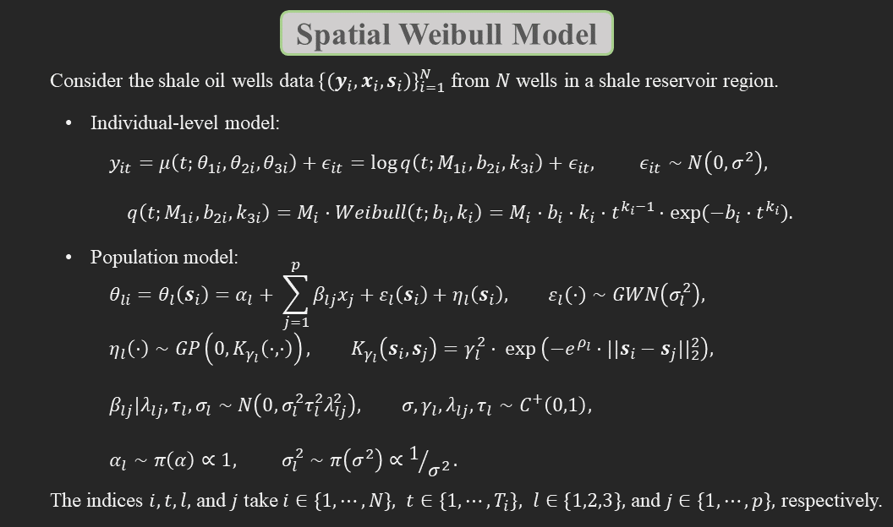
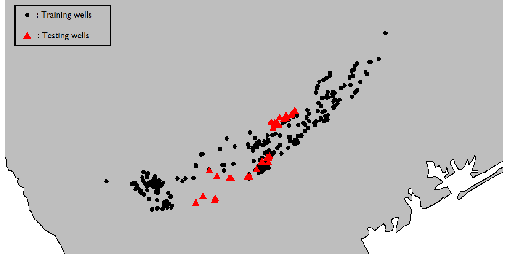
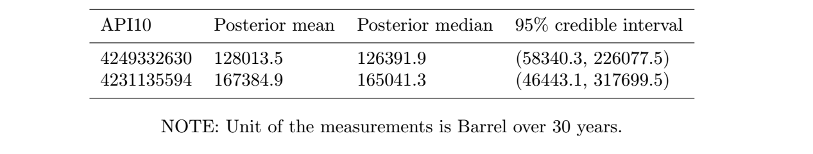

# Prediction of Oil Production Decline Curve of Shale and Tight Oil and Natural Gas Wells at a New Location

## Contents
* [Overview](#Overview)
* [Research Region: The Eagle Ford Shale Reservoir of South Texas](#research-region-the-eagle-ford-shale-reservoir-of-south-texas)
* [A Proposed Model: Spatial Weibull Model](#a-proposed-model-spatial-weibull-model)
* [Results](#Results)

## Overview

Codes of the paper titled  **"Bayesian hierarchical modeling: application towards production results in the Eagle Ford Shale of South Texas"** are available here. This is a joint project of a Ph.D. candidate [Se Yoon Lee](https://sites.google.com/view/seyoonlee) (seyoonlee@stat.tamu.edu) and a University Distinguished Professor [Bani K. Mallick](https://www.stat.tamu.edu/~bmallick/) (bmallick@stat.tamu.edu) at Texas A&M University. We upload some relevant R codes for the spatial Weibull model for the purpose of the (i) posterior inference (via a Gibbs sampler) to train shale oil wells dataset and (ii) spatial prediction at a new test location based on the trained results. 

The source of data is from [Drillinginfo](https://info.drillinginfo.com/). The data is NOT publically available and there can be a cost associated with it charged by the company. Users can purchase the data from the website or can get some similar data and will be able to use our codes. Users can contact the authors for any use or modification of the uploaded codes for the publication purpose or commercial uses.

**Following R packages are required**
  
    library(dplyr,tidyr,ggplot2,maps,mvtnorm,fields) 

**Following R codes are provided**

  1. [SWM.R](https://github.com/yain22/SWM/blob/main/R%20codes/SWM.R) : posterior inference; Gibbs sampling algorithm for the  spatial Weibull model
  
    SWM(Y,X,Loc,seed.no,burn,nmc,thin,prop.var.theta.2,prop.var.theta.3,rho.1,rho.2,rho.3)
      (Y,X,Loc): Production Results from a Shale Reservoir Region
      (seed.no,burn,nmc,thin): MCMC setting for the Gibbs sampling algorithm
      (thin,prop.var.theta.2,prop.var.theta.3): Variances of of Gaussian proposal density used in the Metropolis-Hastings algorithm
      (rho.1,rho.2,rho.3): Range parameters for the geo-statistical Gaussian processes used in the latent kriging of the model          
               
  2. [Prediction_SWM.R](https://github.com/yain22/SWM/blob/main/R%20codes/Prediction_SWM.R) : Monte Carlo simulation for the spatial prediction based on the  spatial Weibull model at a new test location

    Prediction_SWM(index.of.test.well, log_scale = TRUE)
      index.of.test.well: Index of the test well
      log_scale: Display option for the oil production decline curve (log_scale=TRUE/FALSE: Log-scale/original scale)     
 
  3. [Spatial_Prediction.RMD](https://github.com/yain22/SWM/blob/main/Implementation/Spatial_Prediction.Rmd) : R markdown file to implement the (i) posterior inference ([SWM.R](https://github.com/yain22/SWM/blob/main/R%20codes/SWM.R)), having provided training well dataset, and (ii) spatial prediction ([Prediction_SWM.R](https://github.com/yain22/SWM/blob/main/R%20codes/Prediction_SWM.R)), having provided testing well dataset, and then (iii) visualize the prediction results.

## Research Region: The Eagle Ford Shale Reservoir of South Texas
The Eagle Ford shale reservoir (see ***Figure 1***) is known as possibly the largest single economic development in the history of Texas and ranked as the largest oil and gas development in the world based on capital invested; visit [eaglefordshale.com](https://eaglefordshale.com/) for a detail. In this research, we collected production data from 360 hydraulically fractured horizontal shale oil wells from the Eagle Ford shale reservoir of South Texas; see ***Figure 2*** for the locations of the wells. The time frame of the oil production of 360 well is from January 2011 through June 2017. Hydraulic fracturing horizontal drilling is a drilling technique that makes use of water-based fluids to fracture the reservoir rock formation where the drilling of well takes place in a way that the well runs parallel to the rock formation; See ***Figure 3*** for a schematic example. *Completion is defined as the process of making a well ready for the initial production.* In this research, we consider the following completion data (unit): (1) first test flowing tubing pressure (psi); (2) ground elevation (ft); (3) measured depth (ft); (4) true vertical depth (ft); (5) upper perforation (ft); (6) lower perforation (ft); (7) perforated interval length (ft); (8) completion count (integer); (9) first test oil volume (bbl); (10) first test oil gravity; and (11) abstract number. (The unit of abstract number is blocks of land units in Texas. It applies to Texas only.)

***Figure 1: Eagle Ford region with three types of petroleum windows. (Source: [United States Energy Information Administration](https://www.eia.gov/))***

***Figure 2: Locations of 360 research wells. (Source: [Drillinginfo](https://info.drillinginfo.com/))***

***Figure 3: A schematic example of a hydraulically fractured horizontal well***

## A Proposed Model: Spatial Weibull Model
The eventual success of petroleum development projects relies on a large degree of well construction costs. As for unconventional reservoirs, because of very low permeability, and a flow mechanism very different from that of conventional reservoirs, estimates for the well construction cost often contain high levels of uncertainty, and oil companies need to make heavy investment in the drilling and completion phase of the wells. For this reason, one of the crucial tasks of petroleum engineers is to quantify the uncertainty associated with oil or gas production from shale reservoirs, and further, to predict an approximated production behavior of a new well at a new location given specific completion data before actual drilling takes place to save a large degree of well construction costs.

Shale oil wells data comprises three aspects of information: oil production rate time series data (denoted by **y**); completion data (denoted by **x**); and well location data (denoted by **s**). Due to the definition of the completion, we can view the relationship between **y** and **(x,s)** as an output-and-input relationship, hence, the collection of the shale oil wells data formulates a spatial functional data possessing a nested data structure where both temporal and location information should be simultaneously considered.

***In this research, our eventual goal is to propose a Bayesian hierarchical model to digest the spatial functional aspects of the shale oil wells dataset to predict 'beforehand' an approximated production behavior of a new well at a new location given specific completion data.*** To that end, we developed **spatial Weibull model**. The spatial Weibull model is a fully Bayesian version of non-linear mixed effect model where (i) on the first stage the log-scaled production trajectories from N wells are described by a rate decline curve, Weibull model, and (ii) on the second stage latent kriging enables the spatial prediction. Additionally, the sparse horseshoe prior on the second stage is used to find some important completion predictors explaining some productivity of wells. Top panel of the ***Figure 4*** shows the hierarchy of the spatial Weibull model, and the bottom panel displays its directed asymmetric graphical model representation after integrating out the spatial random effects. 

[SWM.R](https://github.com/yain22/SWM/blob/main/R%20codes/SWM.R) is the main R code which implements the Gibbs sampling algorithm for spatial Weibull model to sample from the parameters of the model. Note that the Steps in the code [SWM.R](https://github.com/yain22/SWM/blob/main/R%20codes/SWM.R) coincide with the Steps listed in the **Appendix A.2** of the paper. 

***Figure 4: A hierarhcy of the spatial Weibull model (top) and its graphical model representation (bottom)***

## Results
We use 324 wells as training wells dataset: then, the remaining 36 = 360 - 324 wells are set as the test wells where we validate the performance of the spatial prediction. The locations and production rate trajectories of the training and testing wells are displayed in the ***Figure 5***. 

***Figure 5: Locations (top) and production rate trajectories (bottom) of the training and testing wells***

To investigate how the latent kriging of the spatial Weibull model would help improve the predictive performance, we intentionally selected two test wells with API10 numbers set by API10 = 4249332630 (well-1) and API10 = 4231135594 (well-2). See the top panel in ***Figure 6***. Note that the well-1 is positioned near a certain group of training wells, while the well-2 is more isolatedly located, relatively far from other neighboring wells. We assume that if the latent kriging works, then we will have more accurate prediction results for the well-1 than the well-2.

The bottom panel in ***Figure 6*** displays the prediciton results for the two test well. It turns out that the root-mean-square deviations (RMSD) of the two wells based on the spatial Weibull model are 0.178 (well-1) and 0.305 (well-2). (A lower value for the RMSD indicates a better predictive accuracy.) This implies that the production rates of the well-1 has been more accurately predicted than that of the well-2 as we anticipated. From the panels, we can also observe that pointwise posterior predictive 95 % credible interval of the production rates of the well-1 is relatively narrower than that of the well-2 during the production period. To see the effect of the presence of the latent kriging, we also measured RMSDs based on the non-spatial model, which resulted in 0.180 (well-1) and 0.348  (well-2), higher than the RMSDs based on the spatial one, respectively.

***Figure 6: Locations of two test wells (top) and corresponding production results (bottom) with original and log scales***

***Table 1*** summarizes prediction results for the estimated ultimate recovery (EUR) for the two test wells: posterior mean, posterior median, and posterior predictive 95 % credible interval of EUR. Because either of the wells did not produce oil for 30 years, there is no reference value to validate a predictive accuracy. Note that the posterior predictive 95 % credible interval of EUR of the well-1 is narrower than that of the well-2.

***Table 1: Summaries of estimated ultimate recoveries for the two test wells***

Based on the prediction outcomes of the two test wells along with the results from the Subsection 6.1 in the main paper, we conclude that the latent kriging was beneficial in improving the predictive accuracy (the RMSD) and quality (the length of 95 % credible interval). Note that the spatial Weibull model is designed to use the geological proximity information via the geostatistical stochastic processes, hence, this is not a surprising result. More concretely, under the spatial Weibull model, prediction for the well-1 makes use of the proximity advantage, borrowing more information from the nearby wells, while the isolated position of the well-2 renders its prediction sub-optimal. 
