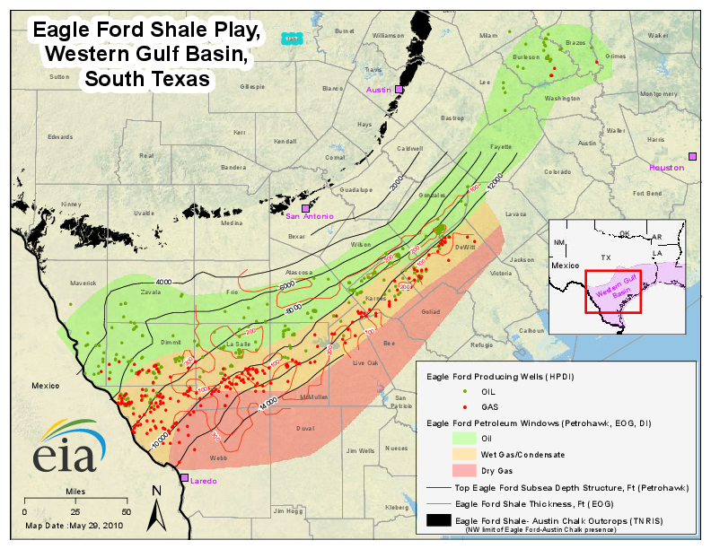

# Spatial Prediction via Spatial Weibull Model

Codes of the paper titled  **"Bayesian hierarchical modeling: application towards production results in the Eagle Ford Shale of South Texas"** are avaiable here. This is a joint project of a Ph.D. student [Se Yoon Lee](https://sites.google.com/view/seyoonlee) (seyoonlee@stat.tamu.edu) and a Distinguished Professor [Bani K Mallick](https://www.stat.tamu.edu/~bmallick/) (bmallick@stat.tamu.edu) at Texas A&M University. We upload the relevant R codes for the spatial Weibull model (SWM) for the purpose of the (i) posterior inference (via a Gibbs sampler) to train shale oil wells dataset and (ii) spatial prediction at a new test location based on the trained results. 

Source of data is from [Drillinginfo](https://info.drillinginfo.com/). The data is NOT publically available and there is a cost associated to it charged by the company. Users can buy the data from the website or can get some similar data and will be able to use our codes. Users MUST contact the authors for any use or modification of our codes for the publication purpose or industrial uses.

**Following R-packages are required:**
1. dplyr
2. tidyr
3. ggplot2
4. maps
5. mvtnorm
6. fields

**Following R-codes are provided:**
1. SWM.R : posterior inference; Gibbs sampling algorithm for the SWM
2. Prediction_SWM.R : Monte Carlo simulation for the spatial prediciton based on the SWM at a new test location
3. Spatial_Prediction.RMD : R markdown file to implement the (i) posterior inference and (ii) spatial prediction based on the SWM.R and Prediction_SWM.R.

# 1. Research Region: Eagle Ford Shale Reservoir of South Texas
The Eagle Ford shale reservoir (see *Figure 1* is known as possibly the largest single economic development in the history of Texas and ranked as the largest oil and gas development in the world based on capital invested; visit [eaglefordshale.com](https://eaglefordshale.com/) for a detail. In this research, we collected production data from 360 hydraulically fractured horizontal shale oil wells from the Eagle Ford shale reservoir of South Texas; see *Figure 2* for the locations of the wells. Time frame of the oil production of 360 well is from January 2011 through June 2017. Hydraulic fracturing horizontal drilling is a drilling technique which makes use of water-based fluids to fracture the reservoir rock formation where the drilling of well takes place in a way that the well runs parallel to the rock formation; See *Figure 3* for a schematic example. Completion is defined as the process of making a well ready for the initial production. Completion data (unit) are as follows: (1) first test flowing tubing pressure (psi); (2) ground elevation (ft); (3) measured depth (ft); (4) true vertical depth (ft); (5) upper perforation (ft); (6) lower perforation (ft); (7) perforated interval length (ft); (8) completion count (integer); (9) first test oil volume (bbl); (10) first test oil gravity; and (11) Abstract number. (Unit of abstract is blocks of land units in Texas. It applies to Texas only.)

*Figure 1: Eagle Ford region with three types of petroleum windows. (Source: [United States Energy Information Administration](https://www.eia.gov/))*

*Figure 2: Locations of 360 research wells. (Source: [Drillinginfo](https://info.drillinginfo.com/))*

*Figure 3: A schematic example of a hydraulically fractured horizontal well*

# 2. Main Purpose of the Reseach
The eventual success of petroleum development projects relies on a large degree of well construction costs. As for unconventional reservoirs, because of very low permeability, and a flow mechanism very different from that of conventional reservoirs, estimates for the well construction cost often contain high levels of uncertainty, and oil companies need to make heavy investment in the drilling and completion phase of the wells. In this research, our eventual goal is to propose a fully Bayesian statistical model to digest the production results from a shale reservoir region to predict *beforehand* an approximated production behavior of a new well at a new location given specific completion data.

To that end, we propose a spatial Weibull model (SWM)

**SWM.R** is the main file which implements the Gibbs sampling algorithm for the Spatial Weibull Model (SWM) to sample from the parameters the model. Note that the Steps in the code **SWM.R** are coincided with the Steps listed in the **Appendix A.2** of the paper. 

